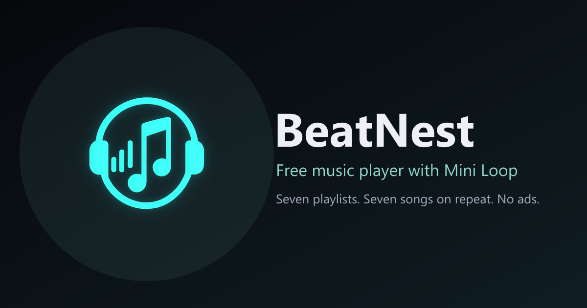

# 🚀 BeatNest

📝 **What it does**
→ A soothing, minimalist music player: stream seven curated playlists, then build a **Mini Loop** – up to seven songs that play back to back, on repeat, for as long as you need.

## 📸 Preview



<!-- TODO: replace with screenshots of the three themes (docs/screenshots/soothing.png, light.png, dark.png) -->

## ✨ Features

→ **Mini Loop** – pick up to 7 songs from any playlist; they repeat seamlessly. Saved to your account, or to the browser for guests (and migrated when you sign up).
→ **Three themes** – Soothing (warm tape-deck paper, default), Light (crisp paper) and Dark (navy night sky), switched from the navbar and remembered.
→ **Calm player** – spinning “reel” now-playing card with a progress ring, shuffle, repeat (off / all / one), seek, volume, keyboard space-bar toggle, lock-screen / media-key controls.
→ **Accounts** – sign up / log in with validated forms, secure httpOnly sessions, CSRF protection, bot protection (honeypot + signed form tokens) and rate limiting.
→ **Launch-ready** – privacy & terms pages, cookie-consent-gated analytics (first-party, Plausible or GA4), per-route SEO/Open Graph tags, sitemap & robots, real HTTP 404s, WCAG AA colour contrast in every theme, responsive down to 375 px.
→ **Fast** – 119 KB of JS, WebP covers with JPEG fallback, immutable hashed assets, brotli/gzip, Range-request audio streaming.

## 🛠 Tech Stack

→ **Frontend:** React 19, React Router 8, Vite 8, plain CSS with design tokens
→ **Backend:** Node 22+/24, Express 5, SQLite via the built-in `node:sqlite` (no native drivers)
→ **Shared:** zod schemas used by both client and server (one source of truth for validation)
→ **Tooling:** npm workspaces, ESLint 9, `node --test`, sharp (image pipeline)

```
beatnest/
├── client/      React app · public/ holds generated icons, images, sitemap, robots
├── server/      Express API, SQLite, media files, tests
├── shared/      zod schemas, route list, constants
├── scripts/     asset pipeline + launch checks (images, icons, sitemap, links, perf, contrast, secrets)
├── assets-src/  raw source images (covers, backgrounds, logo)
├── docs/        LAUNCH-CHECKLIST.md · DEBUG-LOG.md
└── legacy/      the original v1 vanilla JS player, for reference
```

## ⚙️ Installation

Requires **Node 22.13+** (Node 24 recommended).

```bash
git clone https://github.com/hell-walk/BeatNest-music-player-with-miniloop.git
cd BeatNest-music-player-with-miniloop
npm install
npm run assets     # one-off: generate optimised covers, backgrounds, favicons, OG image
npm run sitemap    # generate sitemap.xml + robots.txt
npm run dev        # API on :3000 + Vite on :5173
```

Open <http://localhost:5173>. The database is created and seeded on first start.

| Command | What it does |
| --- | --- |
| `npm run build` | Assets + sitemap + production client build |
| `npm start` | Serve API **and** built client from one process |
| `npm test` | 30 server tests (in-memory DB) |
| `npm run lint` | ESLint on the client |
| `npm run check` | Secrets → contrast → links → perf checks (server must be running) |
| `npm run report -w server` | First-party analytics summary |

## 🔑 Environment Variables

Copy `server/.env.example` → `server/.env`. Nothing here is ever sent to the browser; the client fetches non-secret settings from `GET /api/config`.

| Variable | Required | Purpose |
| --- | --- | --- |
| `SESSION_SECRET` | **production** | Signs session cookies and anti-spam form tokens. Generate: `node -e "console.log(require('crypto').randomBytes(48).toString('base64url'))"` |
| `SITE_URL` | production | Public origin, e.g. `https://beatnest.app` – canonical/OG URLs, CORS, CSRF origin check, sitemap |
| `ENFORCE_HTTPS` / `TRUST_PROXY` | production | `true` / `1` behind a TLS-terminating proxy: http→https redirect + HSTS |
| `ANALYTICS_PROVIDER` | optional | `first-party` (default), `plausible`, `ga4` or `none` (+ `PLAUSIBLE_DOMAIN` / `GA_MEASUREMENT_ID`) |
| `PORT`, `DB_PATH`, `MEDIA_DIR`, `LOG_LEVEL` | optional | Defaults work for local development |

**Never commit `.env`** – it is git-ignored, and `npm run check:secrets` scans client code for leaked keys.

## 🔗 Live Demo

→ Not deployed yet. Run locally with the steps above, or deploy with `npm ci && npm run build && npm start` behind any TLS proxy (nginx, Caddy, Render, Fly, Railway).

## 🗺 Roadmap

→ Sleep timer (stop after N loops / minutes)
→ “Quiet mode” that hides everything but the reel while music plays
→ Themed screenshots in this README and the social preview image in the Soothing palette
→ Playlist search
→ Upload your own tracks

## 🤝 Contributing

1. Fork and create a branch: `git checkout -b feature/your-idea`
2. `npm install`, `npm run dev`, make your change
3. Before opening a PR run `npm run lint && npm test && npm run build`, and `npm run check` against a running `npm start`
4. Keep the product honest: no controls that don't do anything, every colour pair must pass `npm run check:contrast`, one primary button per screen

Bug reports and ideas are welcome as GitHub issues.

## 📄 License

→ Code is released under the [MIT License](LICENSE).
→ The bundled recordings and cover art belong to their respective artists and rights holders and are **not** covered by the license; they are included for personal, non-commercial listening only.
